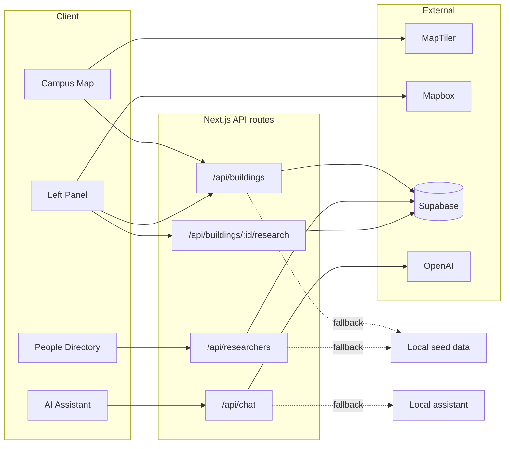

# UAPB Campus Research Map

An interactive campus map for the **University of Arkansas at Pine Bluff (UAPB)**. Explore buildings, view research activity, get walking/driving directions, browse faculty profiles, and ask questions with the built-in AI assistant.

## Features

- **Interactive map** — MapLibre + MapTiler basemap with satellite campus overlay and building pins
- **Building explorer** — Search, select buildings, and view photos, research projects, and researchers
- **Directions** — Walk or drive between buildings (Mapbox Directions API)
- **People directory** — Faculty profiles at `/directory` with photos, bios, and publications
- **AI assistant** — Campus-aware chat (OpenAI when configured; local fallback otherwise)
- **Deep links** — Share a building via `/?building=<id>` or a profile via `/directory?person=<id>`

## Tech stack

| Layer | Tools |
|--------|--------|
| App | [Next.js 16](https://nextjs.org) (App Router), React 19, TypeScript |
| Styling | Tailwind CSS 4 |
| Map | [MapLibre GL](https://maplibre.org), [@turf/turf](https://turfjs.org) |
| Data | Supabase (optional) + local seed fallbacks |
| AI | OpenAI API (optional) |

## Quick start

### Prerequisites

- [Node.js](https://nodejs.org) 20+
- [pnpm](https://pnpm.io) 11+

### 1. Install

```bash
git clone https://github.com/Timeless-Dave/uapb-campus-research-map.git
cd uapb-campus-research-map
pnpm install
```

### 2. Environment

Copy the example file and add your keys:

```bash
cp .env.example .env.local
```

| Variable | Required | Purpose |
|----------|----------|---------|
| `NEXT_PUBLIC_MAPTILER_KEY` | Yes (for map) | Basemap and satellite tiles |
| `NEXT_PUBLIC_MAPBOX_TOKEN` | For directions | Walking/driving routes |
| `NEXT_PUBLIC_SUPABASE_URL` | Optional | Live building & researcher data |
| `NEXT_PUBLIC_SUPABASE_ANON_KEY` | Optional | Supabase public client |
| `OPENAI_API_KEY` | Optional | Full AI chat responses |

The app runs without Supabase or OpenAI — it falls back to bundled seed data and a local assistant.

### 3. Run

```bash
pnpm dev
```

Open [http://localhost:3000](http://localhost:3000).

### 4. Production build

```bash
pnpm build
pnpm start
```

## How it works



1. **Map page (`/`)** loads buildings from `/api/buildings`, renders pins from `public/buildings.geojson`, and shows detail in the left sidebar.
2. **Supabase** is tried first; if unavailable or unset, APIs serve data from `src/lib/buildings-seed.ts` and `src/lib/research-seed.ts`.
3. **Directions** call Mapbox from the browser when `NEXT_PUBLIC_MAPBOX_TOKEN` is set.
4. **Chat** uses OpenAI on the server when `OPENAI_API_KEY` is set; otherwise replies come from campus seed data.

## Supabase setup (optional)

Apply migrations in order under `supabase/migrations/`:

```bash
# Using Supabase CLI (if linked to your project)
supabase db push
```

Or run the SQL files manually in the Supabase SQL editor:

1. `001_initial_schema.sql` — buildings, projects, researchers
2. `002_seed_stem_building_research.sql`
3. `003_researcher_profiles.sql` — profile fields (bio, photo, awards)
4. `004_seed_researcher_profiles.sql`
5. `005_building_images_and_larrison.sql`
6. `006_seed_evans_starling.sql`

## Project structure

```
src/
├── app/
│   ├── (shell)/            # Persistent shell: map + directory share one mount
│   │   ├── page.tsx        # Map explorer route
│   │   └── directory/      # People directory route
│   └── api/                # buildings, researchers, chat
├── components/
│   ├── map/                # CampusMap (MapLibre)
│   ├── layout/             # Sidebar, directions, header
│   ├── building/           # Photo gallery, map embeds
│   ├── directory/          # Profile cards and modal
│   ├── media/              # ResponsiveImage (<picture> over derivatives)
│   └── ai/                 # Floating assistant
├── hooks/                  # useUrlParam (URL-owned selection state)
├── lib/                    # Seeds, directions, Supabase helpers
│   ├── campus-places.generated.ts    # GENERATED from buildings.geojson
│   └── building-images.generated.ts  # GENERATED from assets/
└── types/                  # Shared TypeScript types

assets/                     # Source images — tracked, NOT deployed
├── buildings/              # Full-resolution camera originals
└── site/                   # Site chrome originals

public/                     # Deployed as-is (asset budget: 60 MB)
├── buildings.geojson       # Building footprints for map pins
├── buildings/              # Generated AVIF/WebP/JPEG derivatives
├── site/                   # Generated site chrome derivatives
└── researchers/            # Faculty headshots

supabase/migrations/        # Database schema and seeds
```

## Scripts

| Command | Description |
|---------|-------------|
| `pnpm dev` | Start dev server |
| `pnpm build` | Production build |
| `pnpm start` | Run production server |
| `pnpm lint` | Run ESLint (application source only) |
| `pnpm typecheck` | TypeScript, no emit |
| `pnpm test` | Unit tests (Vitest) |
| `pnpm audit` | Production dependency audit |
| `pnpm check:assets` | Enforce the `public/` size budget |
| `pnpm generate:places` | Regenerate the place catalog from `buildings.geojson` |
| `pnpm optimize:images` | Regenerate image derivatives from `assets/` |
| `pnpm fetch:network` | Refresh the OSM snapshot in `data/osm-network.json` |
| `pnpm import:anchors` | Derive anchor candidates from the snapshot (all `unverified`) |
| `pnpm validate:anchors` | Check navigation anchor geometry and verification claims |
| `pnpm test:e2e` | Playwright browser tests |
| `pnpm verify` | Everything CI runs, in order |

### Working with images

Source photographs live in `assets/`, which is tracked in git but never
deployed — Next only serves `public/`. To add or replace a photo:

1. Drop the original into `assets/buildings/<building-id>/` (or `assets/site/`).
2. Run `pnpm optimize:images`.

That writes AVIF + WebP at 400/800/1600 px plus one JPEG fallback into
`public/`, and regenerates `src/lib/building-images.generated.ts` with the
intrinsic dimensions the UI needs to reserve layout space. Galleries are derived
from that manifest, so there is no photo count to keep in sync. Never put an
unoptimized `.jpeg` in `public/` — `pnpm check:assets` fails on it.

## Navigation anchors (entrances, parking, drop-off)

Routes do not end at a building's geometric centre where a better point is
known. `src/data/place-anchors.json` records, per place, up to four kinds of
arrival point:

| Type | Used for |
|---|---|
| `walking` | public pedestrian entrance |
| `accessible` | confirmed accessible entrance (destination only) |
| `parking` | visitor parking to drive to |
| `dropoff` | passenger drop-off / loading |

Each anchor carries `source`, `verification`, and — once confirmed — `verifiedBy`
and `verifiedAt`.

**The accessibility rule:** the "Accessible entrance" option is only offered
when the destination has an `accessible` anchor with `verification: "verified"`.
There is no fallback. An unverified door that turns out to have steps is worse
than offering nothing, because someone will rely on it. The option simply does
not appear for destinations without a confirmed entrance.

**What that option does and does not promise.** It vouches for the *destination*
only. The path is routed on Mapbox's ordinary walking profile, which carries no
accessibility attributes and may include stairs, curbs, or steep grades. The UI
therefore names the entrance, never the route. Calling any route "step-free"
requires a routing graph with trustworthy accessibility attributes, which this
project does not yet have.

Anywhere no anchor applies, routing falls back to the building centre and the UI
says so explicitly ("Ends at building centre (approximate)"). Imported points
that nobody has checked are labelled "unconfirmed".

### Current coverage

`pnpm import:anchors` pulls candidates from OpenStreetMap. OSM has very little
entrance data for this campus — 3 entrance nodes total, **none** wheelchair-
tagged — so the import yields mostly parking. Everything it writes is
`unverified`.

### Verifying an anchor

Verification is a **data-only** change; no routing code changes:

1. Confirm the point on site or with UAPB facilities.
2. Edit the entry in `src/data/place-anchors.json`: set `verification` to
   `"verified"`, `source` to `"campus-authority"`, and fill in `verifiedBy` and
   `verifiedAt` (`YYYY-MM-DD`).
3. Run `pnpm validate:anchors`.

Set `verification: "rejected"` for a point that was checked and found wrong —
the importer will not resurrect it, and re-running `pnpm import:anchors` never
modifies anything a person has marked `verified` or `rejected`.

### What validation checks

`pnpm validate:anchors` (in CI, with `--require-network`) fails on:

- entrances more than 15m outside their building footprint, measured to the
  footprint **boundary** — a centroid-distance test lets a point far outside a
  large building pass;
- drive-to anchors more than 60m from a drivable road, measured from the parking
  polygon's road-facing boundary where the polygon is known;
- off-campus coordinates, unknown place ids;
- verification claims missing a verifier or date.

Anchors 25–60m from a road are reported as **warnings** and do not fail the
build — plausible but worth a human look.

It does **not** fail on missing anchors; partial coverage is expected and
degrades safely to the labelled centroid fallback.

**Road access is structural, not campus verification.** A pass means "OpenStreetMap
shows a drivable, non-private way adjacent to this lot". It does not mean the lot
is public, signposted, open to visitors, or has spaces. It never changes an
anchor's `verification`. Ways tagged `access=private`, `motor_vehicle=no`, and
untagged driveways are excluded, as are footways, paths, steps and tracks — 239
of the 350 mapped ways qualify as drivable.

Pedestrian-network access for walking entrances is **not** yet validated.

### Network snapshot

Overpass is queried by `pnpm fetch:network` only, which writes
`data/osm-network.json`. Both `import:anchors` and `validate:anchors` read that
committed snapshot, so imports are reproducible and CI never depends on Overpass
being reachable. Without the snapshot, validation warns and skips road checks;
with `--require-network` (as CI runs it) a missing snapshot is a failure.

## Security

- **Never commit** `.env`, `.env.local`, or real API keys.
- Use `.env.example` as the template; keep secrets in `.env.local` only.
- `OPENAI_API_KEY` is server-side only (no `NEXT_PUBLIC_` prefix).

## License

Private — University of Arkansas at Pine Bluff campus research project.
